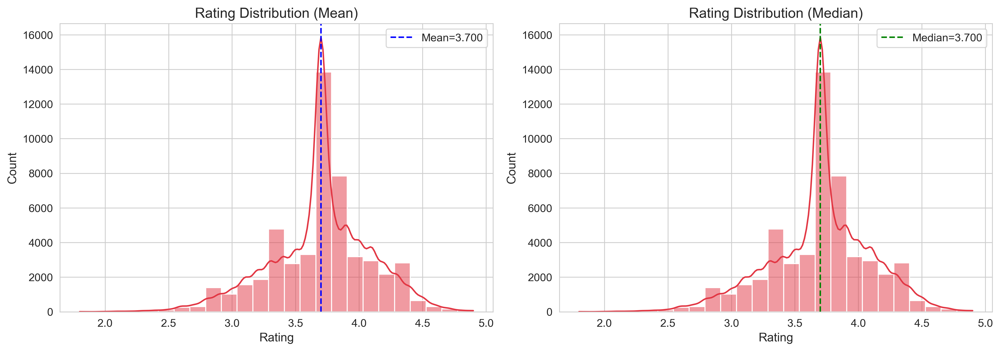
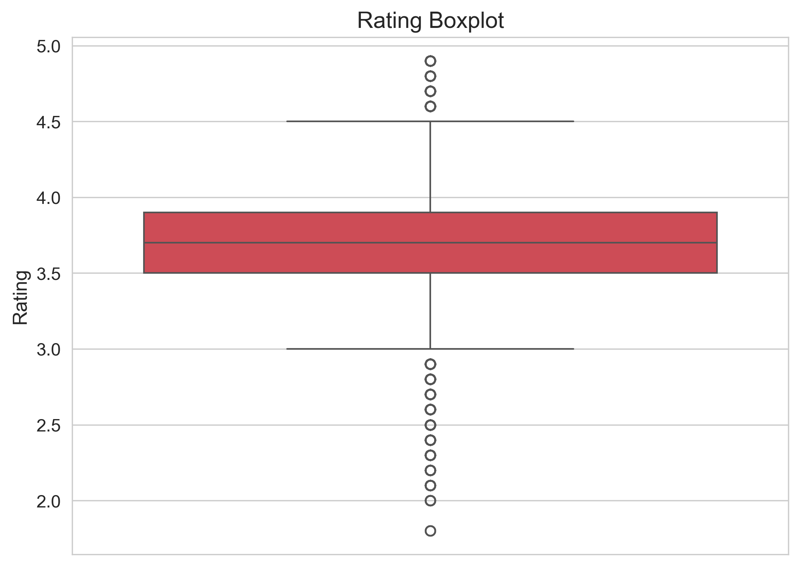
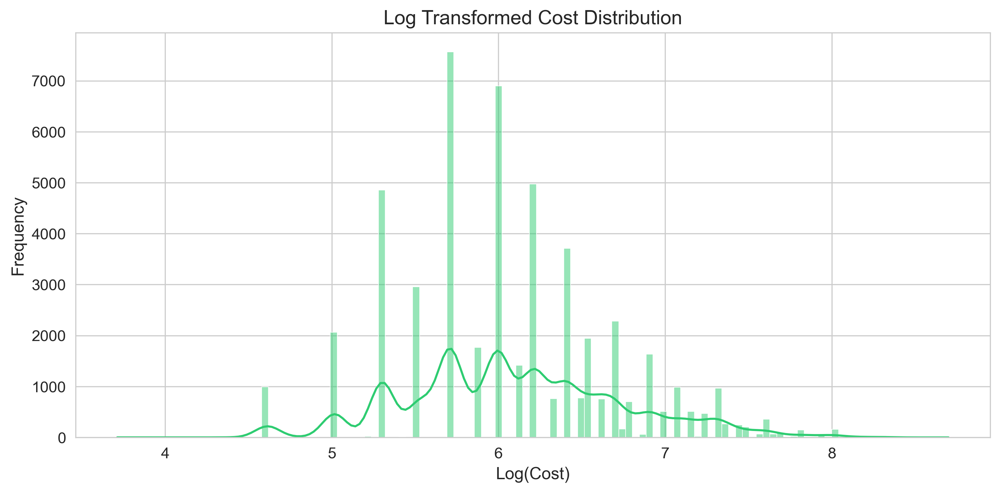
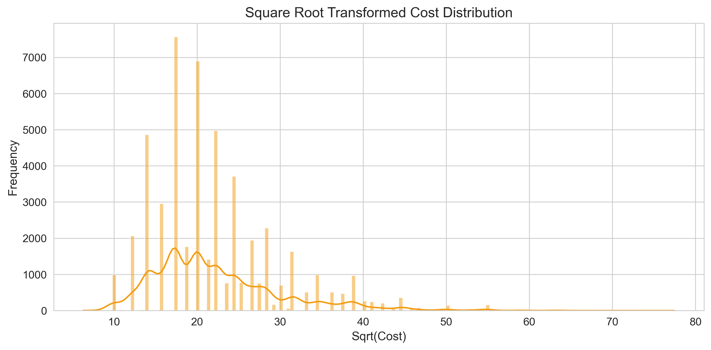
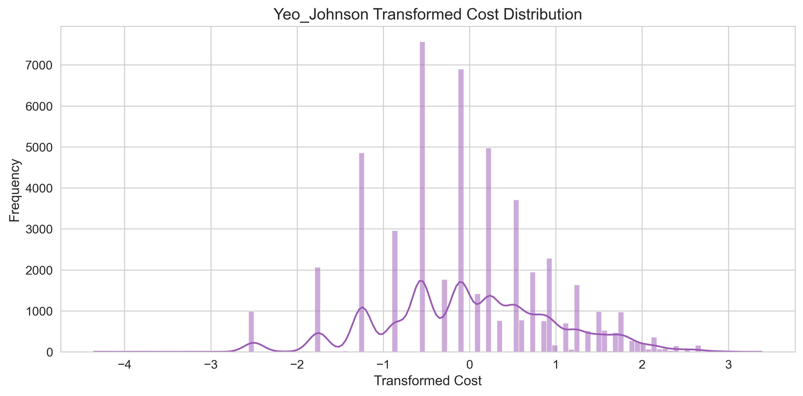

# zomato-eda
Exploratory Data Analysis on Zomato restaurant dataset using Python, Pandas ,Matplotlib , Seaborn and scikit-learn

## Project Status :-) In progress
- [x] Data Cleaning & Preprocessing
- [x] Feature Engineering (partial)
- [x] Univariate Analysis (in progress)
- [ ] Bivariate/Multivariate Analysis
- [ ] Insights and Conclusions

## Dataset Used : 

You can download it from Kaggle (link added): [Zomato Bangalore Restaurants](https://www.kaggle.com/datasets/himanshupoddar/zomato-bangalore-restaurants)

## What is covered till now : 
- Removed the irrelevant text columns ( Some related to NLP and stuff )
- Fixed inconsistent `rate` and `approx_cost` columns
- Text standardization (whitespace removal, title casing)
- Null value handling (median fill, Unknown fill, dropped, high-null cols)
- Binary encoding (`online_order` , `book_table` -> 0/1)
- Feature engineering: `price_category` , `rating_category` (binning)
- Univariate analysis on `rate` and `cost_for_two`
    - Distribution plots, skewness, kurtosis, outlier detection
    - Compared Log1p, Sqrt, Yeo-Johnson transformation to fix right skewed cost data
  

> Also I added descriptions of steps in notebook file ( you can read for better understanding)

## Tools used (or will be used)
Pandas, Numpy, Matplotlib ,Seaborn, Scikit-learn.

## To run this notebook 
1. Just download the dataset `.csv` file from kaggle (about 500+ mb size)
2. Place that `zomato.csv` in same folder where u kept the notebook
3. Run it .

## Output Files
- `zomato_cleaned.csv` : Cleaned dataset generated after preprocessing (9MB)
  - 51632 rows, 12 columns, 0 nulls

## Sample Visualizations

### 1. Rating Distribution (Mean vs Median)

------

### 2. Rating Boxplot 

Boxplot for detecting the potential outliers.

------- 

### 3. Log Transformation

Log1p transformation reduces skewness significantly.

----------

### 4. Sqrt Transformation

This is gentle squashing transformation , it is stronger than doing nothing but weaker than log transform.

------------

### 5. Yeo-Johnson Transformation

Power transformation applied to improve normality.

